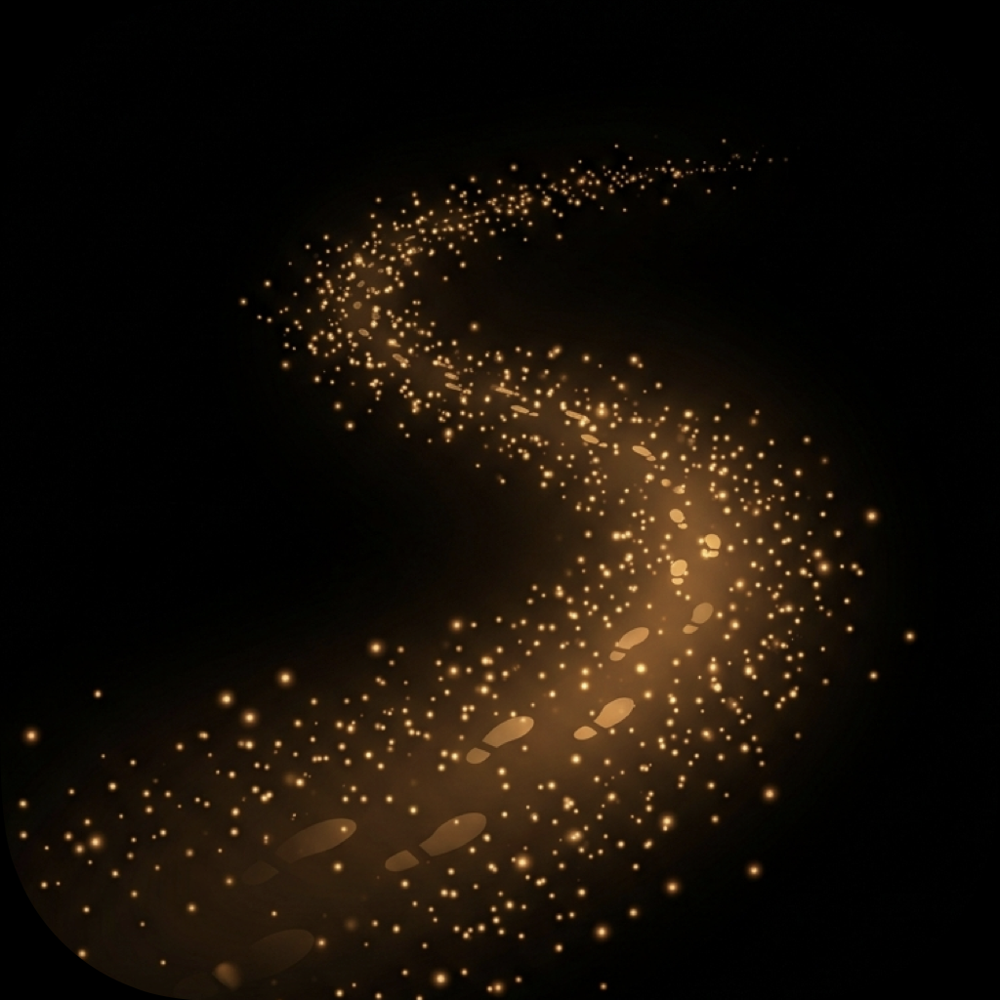

# GloWalk: Path of Light

> A smart flashlight that reads the night. Six sensors, one gentle glow.

**GloWalk** is an iOS night-walking flashlight that adapts its brightness in real time to your surroundings — ambient light, phone posture, screen brightness, dark adaptation, moon phase, and weather. Record your path as a golden constellation trail and weave it into a shareable poster when you arrive.

---

<p align="center">
  
</p>

## Features

- **6-Axis Adaptive Brightness** — Ambient light, posture, screen, dark adaptation, moon phase, and weather all feed into a real-time brightness engine. Each factor can be toggled on or off.
- **Constellation Path Recording** — GPS walking paths are rendered as golden bezier trails with footprint markers. Occasionally, a nocturnal animal silhouette appears.
- **Night Walk Posters** — When your walk ends, GloWalk generates a poster with your path, the night's moon phase, and a poetic tagline. Share it or save it to your photo library.
- **Dark Interface** — Every pixel is designed for night use. Amber-on-black HUD, no white flashes.
- **Bilingual** — Full English and Chinese (Simplified) support. Language switching at runtime.
- **Privacy First** — All data stays on-device. No account required. No analytics. No tracking.

## Screens

| Splash | Walking | Poster |
|--------|---------|--------|
| App icon + tagline | 6-factor HUD + constellation path | Path + moon phase artwork |

## Requirements

- iOS 15.0+
- iPhone (requires rear camera and LED flash)
- Xcode 16+

## Architecture

```
GloWalk/
├── Models/          # MoonPhase, PathProjector, WalkSession, Tagline
├── Services/        # LightEngine, SensorManager, LocationManager, WeatherService, PosterGenerator
├── ViewModels/      # HUDViewModel
├── Views/
│   ├── HUD/         # HUDView, GlowCircleView, ConstellationPathView, MoonWeatherCardView
│   ├── Launch/      # SplashView, PrivacyConsentView
│   ├── History/     # HistoryListView, HistoryPosterView
│   ├── Poster/      # ArrivalSummaryView
│   ├── Settings/    # SettingsView, PermissionsView
│   └── Components/  # HUDButton, ShareSheet
├── Extensions/      # Color, Font, Haptic, L10n, ViewModifiers
└── Resources/       # Fonts, MoonPhases, Taglines.json, Localizable.xcstrings
```

### Brightness Engine

```
brightness = ambient(40%) + posture(25%) + screen(10%) + darkAdapt(10%) + moon(10%) + weather(5%)
```

All six factors contribute proportionally to the gap from optimal brightness. Toggle any factor to see its real-time impact.

## Getting Started

```bash
git clone https://github.com/xingyuwang/GloWalk.git
cd GloWalk
open GloWalk.xcodeproj
```

Build with Xcode 16+ targeting iOS 15.0+. Run on a physical iPhone for full sensor and camera access.

## License

Apache License 2.0 — see [LICENSE](LICENSE) for details.

## Privacy

See [PRIVACY.md](PRIVACY.md).

---

## 中文介绍

**GloWalk: 随行路灯** 是一款为夜间步行设计的智能手电筒。六维感知、一束柔光。

### 功能

- **六维自适应亮度** — 环境光、手机姿态、屏幕亮度、暗适应、月相、天气，六个因素实时计算最合适的亮度，每个因素可独立开关
- **星座路径记录** — GPS 步行路径以金色贝塞尔曲线呈现，起终点有脚印标记，偶尔出现夜行动物剪影彩蛋
- **夜路海报** — 步行结束后自动生成海报，包含路径轨迹、当晚月相照片和诗意格言，可分享或保存
- **深色界面** — 每一像素都为夜间设计，琥珀金配色
- **中英双语** — 完整的中英文支持，运行时可切换
- **隐私优先** — 所有数据仅存本机，无需账号，无分析，无追踪

### 系统要求

- iOS 15.0+
- iPhone（需要后置摄像头和 LED 闪光灯）
- Xcode 16+

### 快速开始

```bash
git clone https://github.com/xingyuwang/GloWalk.git
cd GloWalk
open GloWalk.xcodeproj
```

使用 Xcode 16+ 构建，目标 iOS 15.0+。建议在真机上运行以体验完整的传感器和摄像头功能。
