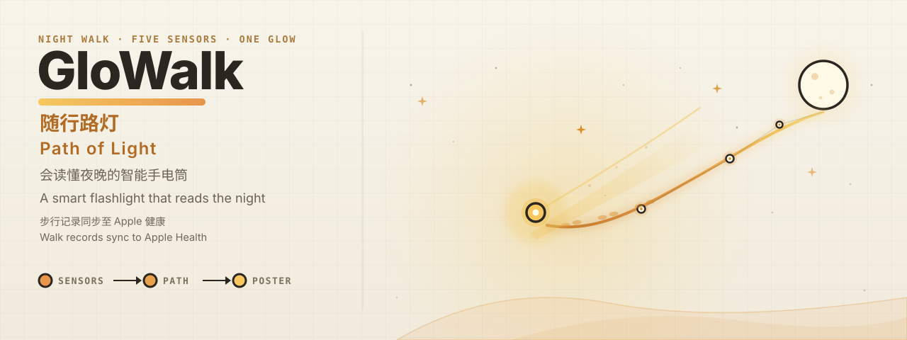
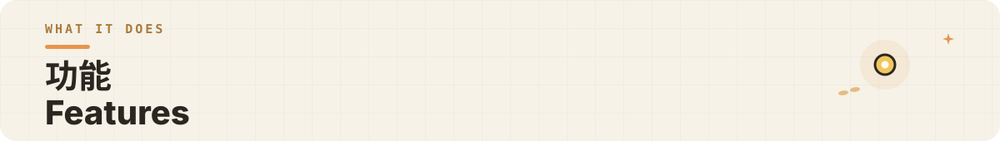
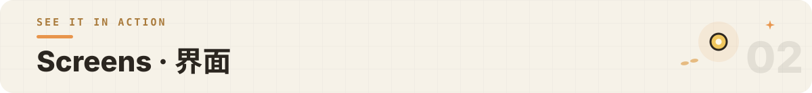
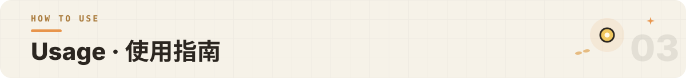
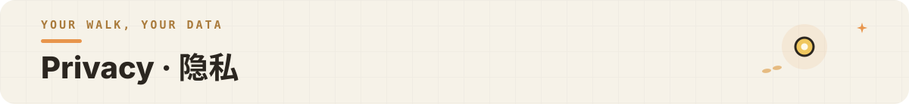
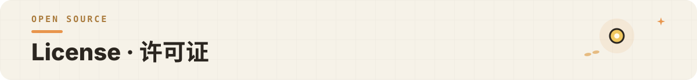

# GloWalk: Path of Light

> A smart flashlight that reads the night. Five sensors, one gentle glow.

<p align="center">
  
</p>

[](https://apps.apple.com/us/app/glowalk-path-of-light/id6794170791)

**GloWalk** is an iOS night-walking flashlight that adapts its brightness in real time to your surroundings — ambient light, phone posture, dark adaptation, moon phase, and weather. Record your path as a golden constellation trail and weave it into a shareable poster when you arrive.

---

<p align="center">
  
</p>

<p align="center">
  
</p>

## Features · 功能

- **5-Axis Adaptive Brightness** — Ambient light, posture, dark adaptation, moon phase, and weather all feed into a real-time brightness engine. Each factor can be toggled on or off.
- **Apple Health Sync** — With your permission, completed walks are written to the Health app as full workout records: steps, distance, duration, and route. Write-only — GloWalk never reads your health data, and nothing leaves your device.
- **Drag-to-Adjust Brightness** — Drag the glow circle up or down through ten discrete levels and release to keep it, or drag all the way down to the brightness bars to turn the torch fully off.
- **Constellation Path Recording** — GPS walking paths are rendered as golden bezier trails with footprint markers. Occasionally, a nocturnal animal silhouette appears.
- **Night Walk Posters** — When your walk ends, GloWalk generates a poster with your path, the night's moon phase, and a poetic tagline. Share it or save it to your photo library.
- **Dark Interface** — Every pixel is designed for night use. Amber-on-black HUD, no white flashes.
- **Trilingual** — Full English, 简体中文, and 繁體中文. Switch languages at runtime.
- **Thermal-Aware** — The rear camera runs only when the adaptive loop needs it, and the torch steps down gently under heat — cooler in hand, longer on the night.
- **Privacy First** — Walk data stays on-device, no account, no analytics, no tracking. Health data is only written to Apple Health with your explicit permission and never leaves your device. Your location is sent to Apple WeatherKit and Open-Meteo only for current weather.

<p align="center">
  
</p>

## Screens · 界面

| Splash | Walking | Poster |
|--------|---------|--------|
| App icon + tagline | 5-factor HUD + constellation path | Path + moon phase artwork |

## Requirements · 环境要求

- iOS 15.0+
- iPhone (requires rear camera and LED flash)
- Xcode 26+

## Architecture · 架构

```
GloWalk/
├── Models/          # MoonPhase, PathProjector, WalkSession, Tagline
├── Services/        # LightEngine, LoopGate, TorchController, TorchThermalPolicy, SensorManager,
│                    # LocationManager, WeatherService, PosterGenerator, HealthKitStore,
│                    # HealthSyncService, HealthWorkoutFactory
├── ViewModels/      # HUDViewModel
├── Views/
│   ├── HUD/         # HUDView, GlowCircleView, ConstellationPathView, MoonWeatherCardView
│   ├── Launch/      # SplashView, PrivacyConsentView
│   ├── History/     # HistoryListView, HistoryPosterView
│   ├── Poster/      # ArrivalSummaryView
│   ├── Settings/    # SettingsView, PermissionsView, HelpView
│   └── Components/  # HUDButton, ShareSheet
├── Extensions/      # Color, Font, Haptic, L10n, ViewModifiers
└── Resources/       # Fonts, MoonPhases, Taglines.json, Localizable.xcstrings
```

### Brightness Engine

```
brightness = ambient(40%) + posture(15%) + darkAdapt(15%) + moon(15%) + weather(15%)
```

All five factors contribute proportionally to the gap from optimal brightness. Toggle any factor to see its real-time impact.

<p align="center">
  
</p>

## Usage Guide · 使用指南

| Action | Gesture |
|--------|---------|
| **Auto brightness** | Automatic — camera + posture + dark adaptation + moon + weather |
| **Manual adjust** | Drag the glow circle up/down — ten discrete levels, release to keep the position |
| **Restore auto** | Single-tap the glow circle |
| **Torch fully off / on** | Drag the glow circle down to the brightness bars (off), or drag it up (on) |
| **End walk** | Double-tap the glow circle → generates poster |
| **Toggle a factor** | Tap any factor card at the bottom |
| **Dismiss poster** | Swipe down on the poster |
| **View past posters** | Tap any walk in history to see its poster again |

## Getting Started · 快速开始

```bash
git clone https://github.com/wxy/GloWalk.git
cd GloWalk
open GloWalk.xcodeproj
```

Build with Xcode 26+ targeting iOS 15.0+. Run on a physical iPhone for full sensor and camera access.

<p align="center">
  
</p>

## Privacy · 隐私

See [PRIVACY.md](PRIVACY.md) — all walk data stays on-device; health data is only written to Apple Health with your permission and never leaves your device.

<p align="center">
  
</p>

## Contributing · 贡献

Code, ideas, and docs are welcome — see [CONTRIBUTING.md](CONTRIBUTING.md).

**Development**: build with Xcode 26+ targeting iOS 15.0+, then run the test suite:

```bash
xcodebuild test -project GloWalk.xcodeproj -scheme GloWalk \
  -destination 'platform=iOS Simulator,name=iPhone 17'
```

<p align="center">
  
</p>

## License · 许可证

Apache License 2.0 — see [LICENSE](LICENSE) for details.

<p align="center">
  
</p>

## Links · 相关链接

- [Website](https://xingyu.wang/apps/glowalk)
- [App Store](https://apps.apple.com/us/app/glowalk-path-of-light/id6794170791)
- [Releases](https://github.com/wxy/GloWalk/releases)
- [Issues](https://github.com/wxy/GloWalk/issues)

---

## 中文介绍

**随行路灯** 是一款为夜间步行设计的智能手电筒。五维感知、一束柔光。

### 功能

- **五维自适应亮度** — 环境光、手机姿态、暗适应、月相、天气，五个因素实时计算最合适的亮度，每个因素可独立开关
- **Apple 健康同步** — 经你授权后，完成的步行会以完整运动记录（步数、距离、时长与路线）写入「健康」App；仅写入、不读取，健康数据不出设备
- **拖动调光** — 拖动中央光晕在十档亮度间调节，松手停留在所选档位；拖到最下方亮度条可完全关闭手电
- **星座路径记录** — GPS 步行路径以金色贝塞尔曲线呈现，起终点有脚印标记，偶尔出现夜行动物剪影彩蛋
- **夜路海报** — 步行结束后自动生成海报，包含路径轨迹、当晚月相照片和诗意格言，可分享或保存
- **深色界面** — 每一像素都为夜间设计，琥珀金配色
- **中英繁三语** — 完整的中文简体、中文繁体与英文支持，运行时可切换
- **更凉爽** — 后置摄像头按需启停，手电在高热时平缓降档，减少发热
- **隐私优先** — 步行数据仅存本机，无需账号，无分析，无追踪；健康数据仅在你授权后写入 Apple 健康，绝不出设备；仅位置信息会发送给 Apple WeatherKit 和 Open-Meteo 获取当前天气

### 使用指南

| 操作 | 手势 |
|------|------|
| **自动调光** | 全自动——摄像头 + 姿态 + 暗适应 + 月相 + 天气 |
| **手动调光** | 在光晕区域上下滑动，十档亮度，松手停留 |
| **恢复自动** | 单击光晕 |
| **完全关灯 / 重新开灯** | 把光晕拖到下方亮度条位置（关灯）；上拖一点即恢复 |
| **结束步行** | 双击光晕 → 生成海报 |
| **因素开关** | 点击底部因素卡片 |
| **关闭海报** | 向下滑动海报 |
| **查看历史海报** | 步行历史中点击记录，重新查看海报 |

### 系统要求

- iOS 15.0+
- iPhone（需要后置摄像头和 LED 闪光灯）
- Xcode 16+

### 快速开始

```bash
git clone https://github.com/wxy/GloWalk.git
cd GloWalk
open GloWalk.xcodeproj
```

使用 Xcode 26+ 构建，目标 iOS 15.0+。建议在真机上运行以体验完整的传感器和摄像头功能。
