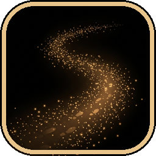
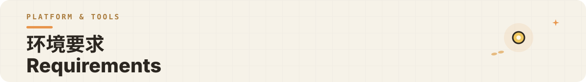
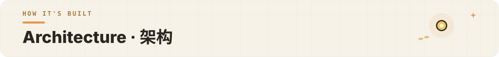
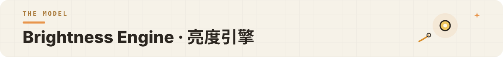
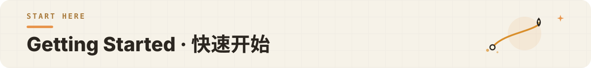

<p align="center">
  
</p>

<p align="center">
  &nbsp;<a href="https://apps.apple.com/us/app/glowalk-path-of-light/id6794170791"></a>
</p>

<p align="center"><code>SWIFT · SWIFTUI · HEALTHKIT · CORE LOCATION · IOS 15.0+</code></p>

> A smart flashlight that reads the night.
> 会读懂夜晚的智能手电筒。

**GloWalk** is an iOS night-walking flashlight that adapts its brightness in real time to your surroundings — ambient light, phone posture, dark adaptation, moon phase, and weather. Record your path as a golden constellation trail and weave it into a shareable poster when you arrive.

> **随行路灯** 是一款为夜间步行设计的智能手电筒。它根据环境光、手机姿态、暗适应、月相和天气五个因素实时调整亮度。把你的步行记录成一条金色星座轨迹，到达后生成一张可分享的夜路海报。

---

<p align="center">
  
</p>

- **5-Axis Adaptive Brightness** — Ambient light, posture, dark adaptation, moon phase, and weather all feed into a real-time brightness engine. Each factor can be toggled on or off.

    > **五维自适应亮度** — 环境光、手机姿态、暗适应、月相、天气，五个因素实时计算最合适的亮度，每个因素可独立开关
- **Apple Health Sync** — With your permission, completed walks are written to the Health app as full workout records: steps, distance, duration, and route. Write-only — GloWalk never reads your health data, and nothing leaves your device.

    > **Apple 健康同步** — 经你授权后，完成的步行会以完整运动记录（步数、距离、时长与路线）写入「健康」App；仅写入、不读取，健康数据不出设备
- **Drag-to-Adjust Brightness** — Drag the glow circle up or down through ten discrete levels and release to keep it, or drag all the way down to the brightness bars to turn the torch fully off.

    > **拖动调光** — 拖动中央光晕在十档亮度间调节，松手停留在所选档位；拖到最下方亮度条可完全关闭手电
- **Constellation Path Recording** — GPS walking paths are rendered as golden bezier trails with footprint markers. Occasionally, a nocturnal animal silhouette appears.

    > **星座路径记录** — GPS 步行路径以金色贝塞尔曲线呈现，起终点有脚印标记，偶尔出现夜行动物剪影彩蛋
- **Night Walk Posters** — When your walk ends, GloWalk generates a poster with your path, the night's moon phase, and a poetic tagline. Share it or save it to your photo library.

    > **夜路海报** — 步行结束后自动生成海报，包含路径轨迹、当晚月相照片和诗意格言，可分享或保存
- **Dark Interface** — Every pixel is designed for night use. Amber-on-black HUD, no white flashes.

    > **深色界面** — 每一像素都为夜间设计，琥珀金配色
- **Trilingual** — Full English, 简体中文, and 繁體中文. Switch languages at runtime.

    > **中英繁三语** — 完整的中文简体、中文繁体与英文支持，运行时可切换
- **Thermal-Aware** — The rear camera runs only when the adaptive loop needs it, and the torch steps down gently under heat — cooler in hand, longer on the night.

    > **更凉爽** — 后置摄像头按需启停，手电在高热时平缓降档，减少发热
- **Privacy First** — Walk data stays on-device, no account, no analytics, no tracking. Health data is only written to Apple Health with your explicit permission and never leaves your device. Your location is sent to Apple WeatherKit and Open-Meteo only for current weather.

    > **隐私优先** — 步行数据仅存本机，无需账号，无分析，无追踪；健康数据仅在你授权后写入 Apple 健康，绝不出设备；仅位置信息会发送给 Apple WeatherKit 和 Open-Meteo 获取当前天气

<p align="center">
  
</p>

| Splash<br>启动 | Walking<br>步行 | Poster<br>海报 |
|--------|---------|--------|
| App icon + tagline<br>应用图标 + 标语 | 5-factor HUD + constellation path<br>五因素 HUD + 星座路径 | Path + moon phase artwork<br>路径 + 月相图 |

<p align="center">
  
</p>

- **iOS** 15.0+
- **iPhone** — requires rear camera and LED flash

    > **iPhone** — 需要后置摄像头和 LED 闪光灯
- **Xcode** 26+

<p align="center">
  
</p>

```
GloWalk/
├── Models/          # MoonPhase, PathProjector, WalkSession, Tagline
├── Services/        # LightEngine, LoopGate, TorchController, TorchThermalPolicy, SensorManager,
│                    # LocationManager, WeatherService, PosterGenerator, HealthKitStore,
│                    # HealthSyncService, HealthWorkoutFactory
├── ViewModels/      # HUDViewModel
├── Views/
│   ├── HUD/         # HUDView, GlowCircleView, ConstellationPathView, MoonWeatherCardView
│   ├── Launch/      # SplashView, PrivacyConsentView
│   ├── History/     # HistoryListView, HistoryPosterView
│   ├── Poster/      # ArrivalSummaryView
│   ├── Settings/    # SettingsView, PermissionsView, HelpView
│   └── Components/  # HUDButton, ShareSheet
├── Extensions/      # Color, Font, Haptic, L10n, ViewModifiers
└── Resources/       # Fonts, MoonPhases, Taglines.json, Localizable.xcstrings
```

<p align="center">
  
</p>

```
brightness = ambient(40%) + posture(15%) + darkAdapt(15%) + moon(15%) + weather(15%)
```

All five factors contribute proportionally to the gap from optimal brightness. Toggle any factor to see its real-time impact.

> 五个因素按各自权重填补"最优亮度"的缺口，实时影响最终亮度。开关任意因素即可看到即时变化。

<p align="center">
  
</p>

| Action<br>操作 | Gesture<br>手势 |
|--------|---------|
| **Auto brightness**<br>**自动调光** | Automatic — camera + posture + dark adaptation + moon + weather<br>全自动——摄像头 + 姿态 + 暗适应 + 月相 + 天气 |
| **Manual adjust**<br>**手动调光** | Drag the glow circle up/down — ten discrete levels, release to keep the position<br>在光晕区域上下滑动，十档亮度，松手停留 |
| **Restore auto**<br>**恢复自动** | Single-tap the glow circle<br>单击光晕 |
| **Torch fully off / on**<br>**完全关灯 / 重新开灯** | Drag the glow circle down to the brightness bars (off), or drag it up (on)<br>把光晕拖到下方亮度条位置（关灯）；上拖一点即恢复 |
| **End walk**<br>**结束步行** | Double-tap the glow circle → generates poster<br>双击光晕 → 生成海报 |
| **Toggle a factor**<br>**因素开关** | Tap any factor card at the bottom<br>点击底部因素卡片 |
| **Dismiss poster**<br>**关闭海报** | Swipe down on the poster<br>向下滑动海报 |
| **View past posters**<br>**查看历史海报** | Tap any walk in history to see its poster again<br>步行历史中点击记录，重新查看海报 |

<p align="center">
  
</p>

```bash
git clone https://github.com/wxy/GloWalk.git
cd GloWalk
open GloWalk.xcodeproj
```

Build with Xcode 26+ targeting iOS 15.0+. Run on a physical iPhone for full sensor and camera access.

> 使用 Xcode 26+ 构建，目标 iOS 15.0+。建议在真机上运行以体验完整的传感器和摄像头功能。

<p align="center">
  
</p>

See [PRIVACY.md](PRIVACY.md) — all walk data stays on-device; health data is only written to Apple Health with your permission and never leaves your device.

> 详见 [PRIVACY.md](PRIVACY.md)——步行数据仅存本机；健康数据仅在你授权后写入 Apple 健康，绝不出设备。

<p align="center">
  
</p>

Code, ideas, and docs are welcome — see [CONTRIBUTING.md](CONTRIBUTING.md). **Development**: build with Xcode 26+ targeting iOS 15.0+, then run the test suite:

> 欢迎提交代码、想法与文档——见 [CONTRIBUTING.md](CONTRIBUTING.md)。**开发**：使用 Xcode 26+ 构建，目标 iOS 15.0+，然后运行测试套件：

```bash
xcodebuild test -project GloWalk.xcodeproj -scheme GloWalk \
  -destination 'platform=iOS Simulator,name=iPhone 17'
```

<p align="center">
  
</p>

Apache License 2.0 — see [LICENSE](LICENSE) for details.

> Apache License 2.0——详见 [LICENSE](LICENSE)。

<p align="center">
  
</p>

- [Website](https://xingyu.wang/apps/glowalk)

    > [官网](https://xingyu.wang/apps/glowalk)
- [App Store](https://apps.apple.com/us/app/glowalk-path-of-light/id6794170791)

    > [App Store](https://apps.apple.com/us/app/glowalk-path-of-light/id6794170791)
- [Releases](https://github.com/wxy/GloWalk/releases)

    > [发布](https://github.com/wxy/GloWalk/releases)
- [Issues](https://github.com/wxy/GloWalk/issues)

    > [问题反馈](https://github.com/wxy/GloWalk/issues)
